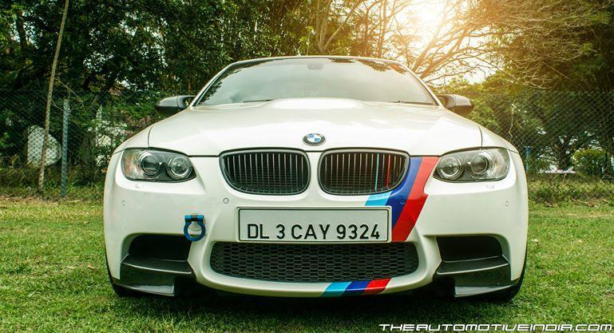
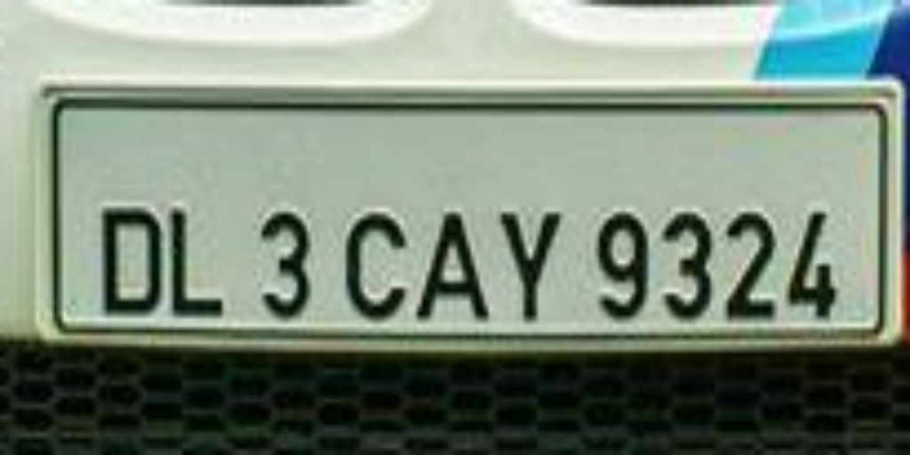
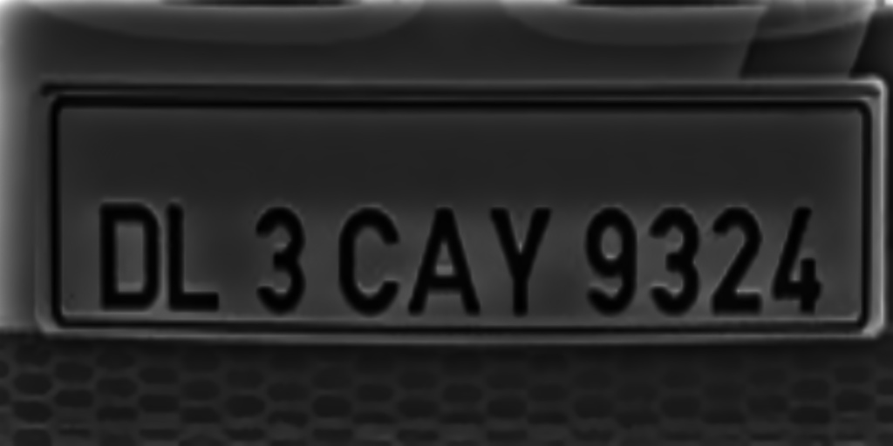
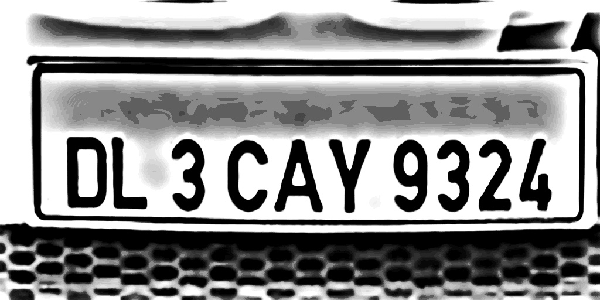
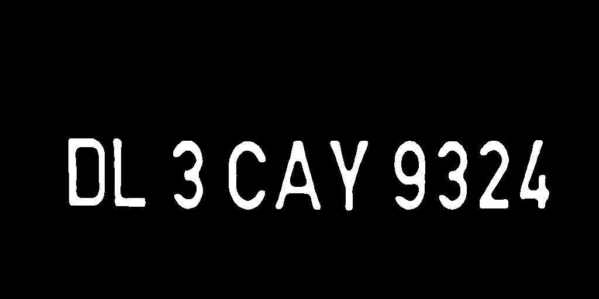
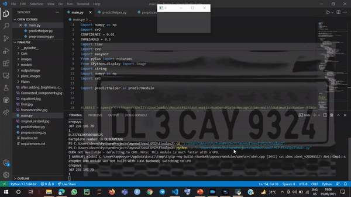

# Vehicle-Number-Plate-Detector-and-Recognizer
## MOSAIC (IIT BHU Electronics Engineering Society's Technical Fest's Event based on Image processing and Machine learning)

### Problem Statement for Round 2

### Task

Your task is to implement an automatic number plate recognizer in an unconstrained condition that considers occlusion, poor quality of images, and other spatial variations in 
image data.
You can access the full problem statement file from [here](https://drive.google.com/file/d/18K7cK0q-hH3SWVwDUodjh8pJwQbV2S0F/view?usp=sharing)

 

Given an image of car, firstly we will use yolo model to extract the plate from the car. Once the number plate is extracted, we used our preprocessing and image cleaning steps. The preprocessing begins with the function get_preprocessed() which first resize the image, removes the noises and then perform homomorphic filtering to separate the illumination and reflectance of the image. Then, we filtered these two components separately. Shading is generally due to illumination so we decrease its contribution. We then boost the reflectance to have better edge appearance. Once these individual filtering is done, we combine these components and obtained a better image in which characters are more recognisable. Then we perform histogram equalization so that the contrast of the image improves and have a better spread of intensity values. After performing the previously mentioned steps, the image gets darker so to maintain brightness and contrast we use function apply_brightness_contrast() .After applying thresholding techniques like adaptive thresholding, OTSU thresholding, simple thresholding, we found that  adaptive thresholding is not working for all scenarios sometimes it masks the noise in the background and also sometimes when the characters are too close than adaptive thresholding merges two or more characters. Hence we stick with normal thresholding which worked for most of the cases.

                 Initial plate image                                     preprocessed image
                                   

               After Histogram Equalization                         After adding brightness and contrast
                                   

For segmenting individual components, we use Connected Component Analysis using function ConnectedComp() : Majorly this function has two parts. In this first part, all components in the binarized image will be given an unique component id and the background will have the id 0. Once we have all components labels (we’ll exclude background component), we are going to second part. In this part, based on the stats of the components like height, width and area, we are going to discard some of the components that are either too small or too large because we need to filter irrelevant components like bolts, brand logo etc, which will be having noticeable different dimensions or shape as compared to number plate characters. Once the components we desire for we got, we will then print them on a black background. The motivation behind using Connected Component analysis, we will be getting only the number plate characters in the end whereas as the noises will be separated out.

               After connected components
 

For correcting the skewness of the characters we use the function deskew() which uses the function get_skew_angle and rotate_image to nullify the skewness. For calculating the angle, we first dilated the image so that one big contour would form and which will be enough for getting skewed angle using MinRect function of opencv.

               Fixing the skewness(if any) and dilation

We now reached to our final processed image, we then segment these characters to output them. After that we run our EasyOCR model to recognise the characters and the output will be printed in the terminal.

### Glimpse of the project

